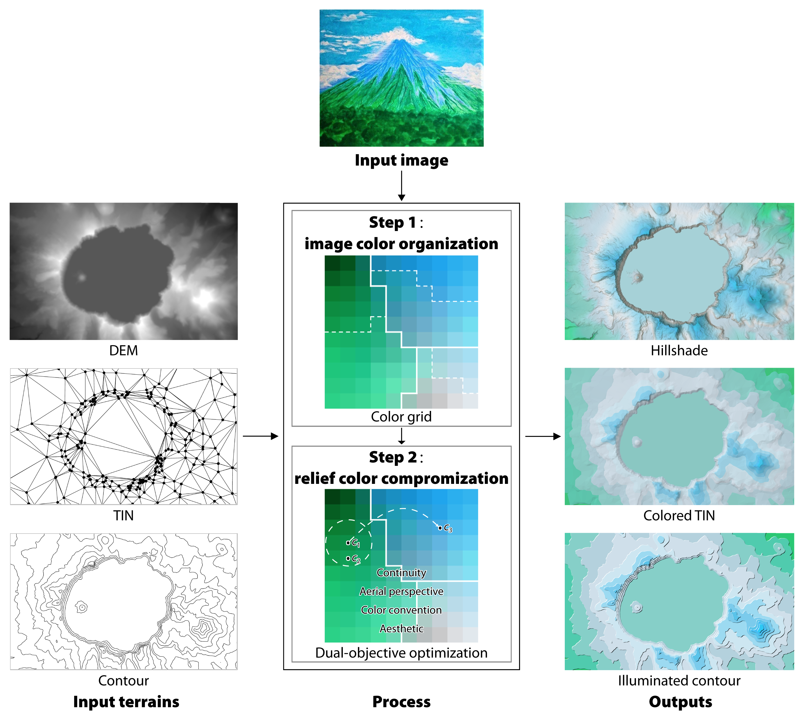

# TerrainColorTranser
**Adaptive color transfer from images to terrain visualizations**

Mingguang Wu, Yanjie Sun, and Shangjing Jiang

Paper: https://arxiv.org/abs/2205.14908

Abstract: Terrain mapping is not only dedicated to communicating how high or steep a landscape is but can also help to indicate how we feel about a place. However, crafting effective and expressive elevation colors is challenging for both nonexperts and experts. In this paper, we present a two-step image-to-terrain color transfer method that can transfer color from arbitrary images to diverse terrain models. First, we present a new image color organization method that organizes discrete, irregular image colors into a continuous, regular color grid that facilitates a series of color operations, such as local and global searching, categorical color selection and sequential color interpolation. Second, we quantify a series of subjective concerns about elevation color crafting, such as the “lower, higher” principle, color conventions, and aerial perspectives. We also define color similarity between images and terrain visualizations with aesthetic quality. We then mathematically formulate image-to-terrain color transfer as a dual-objective optimization problem and offer a heuristic searching method to solve the problem. Finally, we compare elevation colors from our method with a standard color scheme and a representative color scale generation tool based on four test terrains. The evaluations show that the elevation colors from the proposed method are most effective and that our results are  visually favorable. We also showcase that our method can transfer emotion from images to terrain visualizations.

